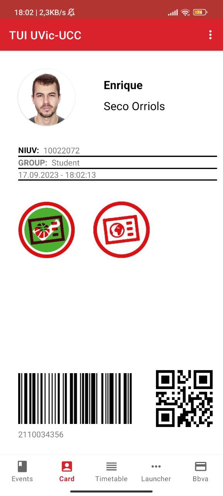

# UVic App

This [Android](https://www.android.com/) application is a replica of the student app used at my university, 
where I studied computer science.

## Table of Contents

- [Features](#features)
- [Getting Started](#getting-started)
- [Contributing](#contributing)
- [License](#license)

## Features

- Reverse engineering
- Bottom Navigation Bar
- Options menu

## Getting Started

To run UVic app on your local machine, follow these steps:

1. Clone this repository: `git clone https://github.com/enriqueseor/uvic-app.git`
2. Open the project in Android Studio.
3. Choose a physical or virtual device. 
4. Build and Run the project.

## Contributing

Contributions are welcome! If you'd like to contribute to Berry Game, please follow these steps:

1. Fork this repository.
2. Create a new branch: `git checkout -b feature/your-feature-name`.
3. Make your changes and commit them: `git commit -am 'Add new feature'`.
4. Push to the branch: `git push origin feature/your-feature-name`.
5. Create a pull request.

## License

This project is licensed under the [MIT License](LICENSE).